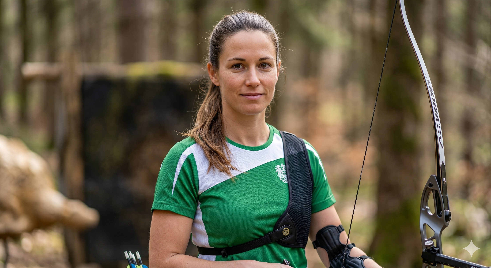

# Stakeholder Persona 3: Ergebnisbeauftragter / Registrierung

| Element | Beschreibung |
|---|---|
| **Name & Foto** | Sandra Klein    |
| **Rolle** | Ergebnisbeauftragte und Registrierungsleiterin, WBHC 2027 |
| **Kurzprofil** | 39 Jahre, arbeitet beim DFBV als Veranstaltungskoordinatorin. Hat bereits bei mehreren nationalen Meisterschaften die Ergebniserfassung geleitet und kennt die IFAA-Klassifizierungsregeln gut. |
| **Aufgaben** | Entgegennehmen und Prüfen von Anmeldungen, Verifikation der Klassifizierungskarten (Klasse A/B/C je Stil), Eingabe der täglichen Schussergebnisse, Berechnung von Tages- und Gesamtranglisten, Verwaltung von Gleichständen (Tie-Breaks), Ausgabe offizieller Ergebnislisten. |
| **Daten, die sie nutzt** | Vollständige Teilnehmerdaten, Klassifizierungsangaben (Stil, Division, Klasse), Schussergebnisse pro Ziel und Runde (Pfeilnummer, Trefferzone, Punktwert), Gesamtranglisten je Stil/Division/Klasse. |
| **Was sie braucht** | Übersichtliche Eingabemasken für Schussergebnisse, automatische Klassifizierungsprüfung bei der Anmeldung, automatische Ranglistenberechnung nach Gesamtpunkten und Tie-Break-Regeln, Exportfunktion für offizielle Ergebnislisten (PDF, CSV). |
| **Sorgen** | Fehler bei der Scoreeingabe sind schwer rückgängig zu machen. Klassifizierungsprüfung bei 1.200 Schützen ist sehr aufwendig. Tie-Break-Verfahren (Shoot-off über 3D-Ziele) müssen klar abgebildet sein. |
| **Kommunikation** | Sachlich und detailorientiert, schätzt klare Fehlermeldungen und Validierungsrückmeldungen direkt im System. |
