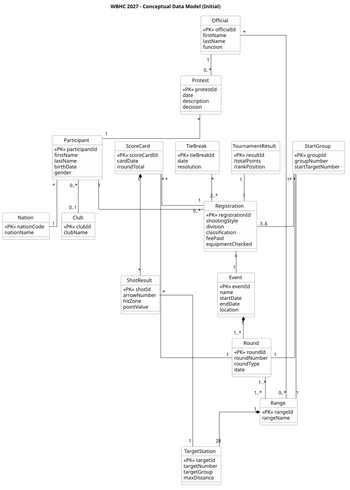
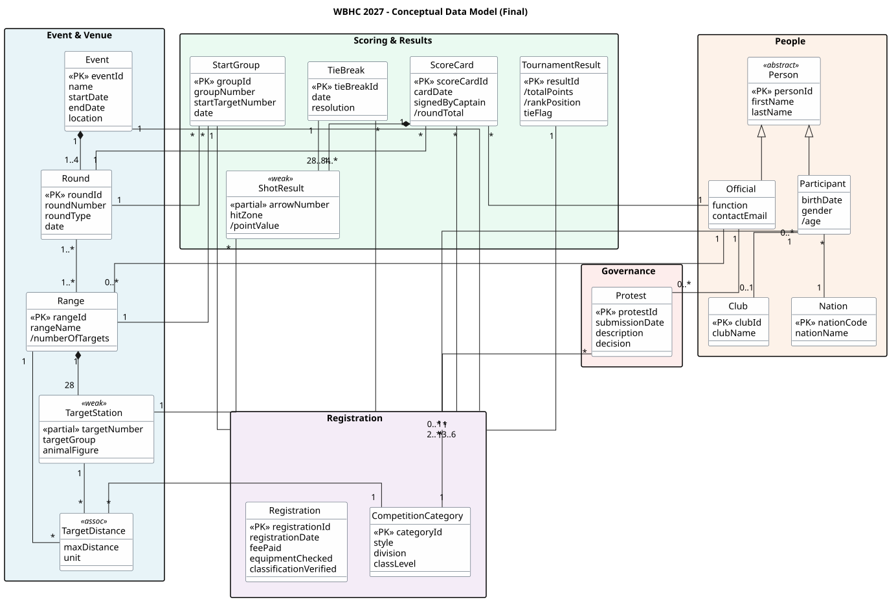

# Assignment 02 – Aufgabe 2: Erstellung des konzeptuellen Datenmodells

**Domäne:** IFAA World Bowhunter Championships (WBHC) 2027, Bad Waldsee
**Notation:** UML Data Model Profile · **Werkzeug:** PlantUML
**Methodik:** Connolly & Begg (2015), Kapitel 16, Schritte 1.1–1.9

---

## Schritt 1.1 – Entitätstypen

| # | Entität | Beschreibung |
|---|---|---|
| 1 | Event | Die WBHC 2027 selbst. |
| 2 | Round | Eine der vier Turnierrunden. |
| 3 | Range | Eine physische Strecke mit 28 Zielen. |
| 4 | TargetStation | Eines der 28 Ziele einer Range. |
| 5 | Participant | Ein einzelner Bogenschütze. |
| 6 | Nation | Das Land, das ein Teilnehmer vertritt. |
| 7 | Club | Verein, dem ein Teilnehmer angehört. |
| 8 | Official | Schiedsrichter, Target Captain oder Turnierdirektor. |
| 9 | Registration | Anmeldung eines Teilnehmers zum Event. |
| 10 | CompetitionCategory | Kombination aus Style, Division und Class. |
| 11 | StartGroup | Gruppe von 3–6 Schützen, die gemeinsam schießen. |
| 12 | ScoreCard | Scorekarte eines Teilnehmers für eine Runde. |
| 13 | ShotResult | Ergebnis eines einzelnen Pfeils. |
| 14 | TournamentResult | Aggregiertes Gesamtergebnis eines Teilnehmers. |
| 15 | TieBreak | Stechen zwischen punktgleichen Teilnehmern. |
| 16 | Protest | Formelle Regelentscheidung. |

---

## Schritt 1.2 – Beziehungstypen

| # | Beziehung | Entität 1 | Entität 2 | Multiplizität |
|---|---|---|---|---|
| R1 | consistsOf | Event | Round | 1 : 1..4 |
| R2 | uses | Round | Range | 1..* : 1..* |
| R3 | contains | Range | TargetStation | 1 : 28 |
| R4 | submits | Participant | Registration | 1 : 0..* |
| R5 | forEvent | Registration | Event | * : 1 |
| R6 | categorisedAs | Registration | CompetitionCategory | * : 1 |
| R7 | representsNation | Participant | Nation | * : 1 |
| R8 | memberOf | Participant | Club | 0..* : 0..1 |
| R9 | forRound | StartGroup | Round | * : 1 |
| R10 | assignedToRange | StartGroup | Range | * : 1 |
| R11 | includes | StartGroup | Registration | 1 : 3..6 |
| R12 | recordsFor | ScoreCard | Registration | * : 1 |
| R13 | forRound | ScoreCard | Round | * : 1 |
| R14 | contains | ScoreCard | ShotResult | 1 : 28..84 |
| R15 | atTarget | ShotResult | TargetStation | * : 1 |
| R16 | signedBy | ScoreCard | Official | * : 1 |
| R17 | summarises | TournamentResult | Registration | 1 : 1 |
| R18 | resolvesTie | TieBreak | Registration | * : 2..* |
| R19 | uses | TieBreak | ShotResult | 1 : 1..* |
| R20 | assignedToRange | Official | Range | 1 : 0..* |
| R21 | decides | Official | Protest | 1 : 0..* |
| R22 | concerns | Protest | Registration | * : 1 |

---

## Schritt 1.3 – Klassifizierung der Attribute

| Attribut | Entität | Typ |
|---|---|---|
| age | Participant | abgeleitet (aus birthDate) |
| pointValue | ShotResult | abgeleitet (roundType + hitZone + arrowNumber) |
| roundTotal | ScoreCard | abgeleitet (Summe pointValue) |
| totalPoints | TournamentResult | abgeleitet (Summe roundTotal) |
| rankPosition | TournamentResult | abgeleitet (Rang in CompetitionCategory) |
| numberOfTargets | Range | abgeleitet (Anzahl TargetStation) |
| firstName + lastName | Person | zusammengesetzt (atomare Namensbestandteile) |

Alle übrigen Attribute sind einfach, einwertig und nicht abgeleitet. Mehrwertige Attribute wurden nicht identifiziert.

---

## Schritt 1.4 – Wertebereiche der Attribute

| Attribut | Wertebereich |
|---|---|
| roundType | {UnmarkedAnimal_3Arrow, Standard3D_2Arrow, Hunting3D_1Arrow} |
| hitZone | {Kill, Vital, Wound, Miss} |
| targetNumber | Integer [1..28] |
| arrowNumber | Integer [1..3] |
| targetGroup | Integer [1..4] |
| style | {BB, BBR, BHR, BL, BU, FS, FSR, FU, LB, TR} |
| division | {Adult, Veteran, Senior, YoungAdult, Junior, Cub} |
| classLevel | {A, B, C} |
| nationCode | Text[3] (ISO 3-Buchstaben) |
| pointValue | Integer [0..20] |
| Alle Datumsangaben | ISO 8601 (YYYY-MM-DD) |
| Alle Booleans | {true, false} |

---

## Schritt 1.5 – Schlüssel

| Entität | Primärschlüssel | Alternativer Schlüssel | Typ |
|---|---|---|---|
| Event | eventId | (name, startDate) | stark |
| Round | roundId | (eventId, roundNumber) | stark |
| Range | rangeId | rangeName | stark |
| TargetStation | (rangeId, targetNumber) | – | **schwach** |
| Participant | participantId | – | stark |
| Nation | nationCode | nationName | stark |
| Club | clubId | clubName | stark |
| Official | officialId | – | stark |
| Registration | registrationId | (eventId, participantId) | stark |
| CompetitionCategory | categoryId | (style, division, classLevel) | stark |
| StartGroup | groupId | (roundId, groupNumber) | stark |
| ScoreCard | scoreCardId | (registrationId, roundId) | stark |
| ShotResult | (scoreCardId, targetNumber, arrowNumber) | – | **schwach** |
| TournamentResult | resultId | registrationId | stark |
| TieBreak | tieBreakId | – | stark |
| Protest | protestId | – | stark |

---

## Schritt 1.6 – Erweiterte Modellierung

**Übernommen:** Generalisierung `Person` über `Participant` und `Official` (gemeinsame Attribute `firstName`, `lastName`).

**Verworfen:** Subtypen je `roundType` — als Aufzählungsattribut belassen, da der Unterschied datengetrieben ist (Pfeile pro Ziel), nicht strukturell.

---

## Schritt 1.7 – Redundanzprüfung

| # | Befund | Maßnahme |
|---|---|---|
| 1 | (style, division, class) mehrfach über Registrations | Zu Entität `CompetitionCategory` erhoben |
| 2 | `maxDistance` von Kategorie abhängig (wäre mehrwertig) | In Assoziationsklasse `TargetDistance` ausgelagert |
| 3 | Keine redundanten Beziehungen vorhanden | – |
| 4 | Zeitdimension bei Nation/Club für Einzelevent nicht nötig | – |

---

## Schritt 1.8 – Validierung gegen Transaktionen

Erste Prüfung der Transaktionen T1–T8 (aus Aufgabe 1) ergab drei Lücken, die zu den obigen Anpassungen führten. Die vollständige Transaktions-Modell-Matrix folgt in Aufgabe 4.

| Transaktion | Initiales Modell | Maßnahme |
|---|---|---|
| T1 – Teilnehmer anlegen | ✓ | – |
| T2 – Klassifizierung prüfen | ✓ | – |
| T3 – Startgruppen erstellen | Lücke | `CompetitionCategory` ergänzt |
| T4 – Scorekarte erfassen | ✓ | – |
| T5 – Rangliste anzeigen | Lücke | `CompetitionCategory` ergänzt |
| T6 – Tie-Break erfassen | ✓ | – |
| T7 – Protest dokumentieren | Lücke | Verknüpfung mit Registration (nicht Participant) |
| T8 – Ergebnisliste exportieren | Lücke | `TargetDistance` ergänzt |

Nach der Überarbeitung: **alle 8 Transaktionen werden durch das finale Modell unterstützt.**

---

## Schritt 1.9 – Review mit Anwendern

Das finale Modell wird den drei Personas aus Aufgabe 1 (Klaus Brenner, Maria Weiss, Sandra Klein) zur Abnahme vorgelegt. Offene Klärungspunkte sind in Aufgabe 5 dokumentiert.

---

## Initiales konzeptuelles Datenmodell

Quelle: [`assets/diagrams/conceptual-model-initial.puml`](assets/diagrams/conceptual-model-initial.puml)

---

## Finales konzeptuelles Datenmodell

Quelle: [`assets/diagrams/conceptual-model-final.puml`](assets/diagrams/conceptual-model-final.puml)

---

## Änderungen zwischen initialem und finalem Modell

| # | Änderung | Begründung | Schritt |
|---|---|---|---|
| 1 | `CompetitionCategory` ergänzt | Redundanz von (style, division, class) entfernt | 1.7 |
| 2 | Assoziationsklasse `TargetDistance` ergänzt | Distanz abhängig von (Ziel, Kategorie) | 1.7 |
| 3 | Supertyp `Person` ergänzt | Vermeidet doppelte Namensattribute | 1.6 |
| 4 | `Protest` jetzt mit Registration verknüpft | Protest betrifft konkrete Anmeldung | 1.8 |
| 5 | Beziehung `signedBy` ergänzt | Bildet Unterschrift des Target Captains ab | 1.8 |
| 6 | Multiplizität `28..84` auf ScoreCard → ShotResult | Spiegelt rundentyp-abhängige Pfeilanzahl | 1.2 |
| 7 | Schwache Entitäten explizit markiert | Existenzabhängig vom Eltern­objekt | 1.5 |
